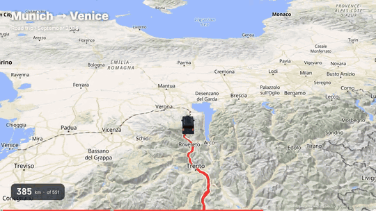
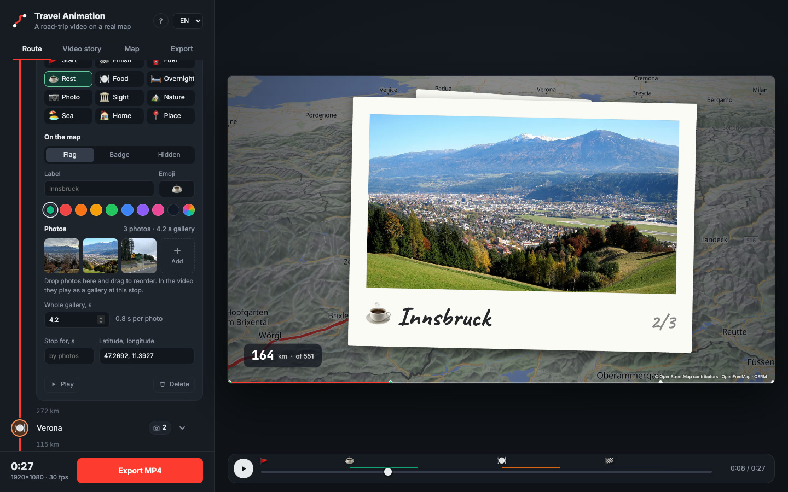

# Travel Animation — free animated travel map video maker

[Русский](README.ru.md)

**Turn your road trip into an animated map video: a car drives along real roads, your photos play at
each stop, and you get an MP4 for Reels, TikTok or YouTube. Free, in the browser, no sign-up, no
watermark.**

### 👉 [Open Travel Animation](https://topmonroe9.github.io/travel-animation/) · [Step-by-step guide](https://topmonroe9.github.io/travel-animation/guide/)



No installation, no account, no GitHub knowledge needed: open the link above in Chrome, Edge or Arc on
a computer.

## Make your video in four steps

1. **Add stops.** Type a city or an address and press Enter. The route is built along real roads with
   distances between stops. Drag stops to reorder, or paste the whole list with “Paste as a list”.
2. **Style stops and add photos.** Click a stop icon to choose its type (fuel, rest, food, overnight,
   sight, nature, sea…), how it looks on the map (flag, badge or hidden), a label, emoji and color. Drop
   photos onto the stop; iPhone photos work too. “Whole gallery, s” sets how long that stop’s photos play.
3. **Set up the story.** The Video story tab has captions, gallery style (polaroids or slides), photo
   size, seconds per photo and timing. On the Route tab the odometer can start from any value, such as
   2,500 km for the second leg of a trip.
4. **Export MP4.** On the Export tab choose 16:9 (YouTube), 9:16 (Reels, Shorts, TikTok) or 1:1 and the
   quality up to 4K. Press “Export MP4” and keep the tab visible while it renders.



## What ends up in the video

- a route along real roads: the travelled part glows, the road ahead is dashed;
- a 3D car (or your own image), with the camera turning along the road;
- terrain with 3D mountains and hillshade;
- stop flags and badges with emoji;
- photo galleries at stops: the car slows down, photos fly out of the flag, flip by and fly back;
- title, subtitle, a running odometer and a progress bar with stop marks.

## Questions

**Is it free?** Completely: no subscription, no watermark, no sign-up. The code is open source (MIT).

**Where do my photos go?** Nowhere. They are processed and stored in your browser on your computer. Only
stop names (to find them on the map) and coordinates (to build the route) are sent over the internet.

**Which browser do I need?** Chrome, Edge or Arc on a computer. Export on phones is not tested.

**How long does export take?** It depends on length, quality and your connection: a 30-second 1080p
video usually takes a few minutes.

**Is it an alternative to TravelBoast, Mult.dev or Travel Animator?** It makes the same kind of video — an
animated route on a map — for free, up to 4K and without a watermark.

Full illustrated guide: https://topmonroe9.github.io/travel-animation/guide/

---

# For developers

## Run locally

```bash
git clone https://github.com/topmonroe9/travel-animation.git
cd travel-animation
npm start            # python3 serve.py 8765 — static files with caching disabled
open http://127.0.0.1:8765
```

Use `127.0.0.1` rather than `localhost` (Chrome tries IPv6 first, the dev server listens on IPv4).
There is no build step: plain static files with libraries from CDNs. Every push to `main` is published
to GitHub Pages. The interface follows the browser language (Russian or English).

Interface details: stops live in localStorage, photos in IndexedDB (downscaled to 2400 px, HEIC via
heic2any); the “Paste as a list” text format is `Innsbruck #fuel`, `Verona #sleep ~3`,
`Cabin @ 46.49, 11.33`. “Driving” in timing is pure motion time; stops and galleries add to it. For search
engines and AI assistants there are `guide/` (EN/RU), `llms.txt`, `sitemap.xml` and JSON-LD on the pages.

## Architecture

```
Stops (list) ──────▶ Nominatim (geocoding) ──▶ OSRM demo (road route, GeoJSON)
                                                        │
                                                        ▼
                                  Polyline: cumulative km, point/bearing at d, slice 0…d
                                                        │
 Timeline t ──▶ intro → drive (segments between stops, braking + holds / galleries) → outro
                                                        │
                                                        ▼
                     Camera: centre shifted ahead, zoom, smoothed bearing, pitch
                                                        │
                                                        ▼
        MapLibre GL ── OpenFreeMap (vector tiles, localized labels) + AWS Terrain (DEM)
        layers: hillshade / terrain / sky · route ahead · travelled (glow+casing+line)
               · stop flags · car (SVG symbol | three.js custom layer)
                                                        │
                     HUD (canvas 2D): captions, km, progress, photo gallery, attribution
                                                        │
   export: for t in frames → jumpTo/setData → wait for idle → composite(map+hud) → VideoFrame
           → VideoEncoder (H.264, WebCodecs) → mp4-muxer → Blob → download .mp4
```

The key principle is **determinism**: the whole frame state is a function of time `t`. Preview and export
call the same `render(t)`, so the video matches what you see on screen, and tiles and glyphs are always
loaded because the exporter waits for the map's `idle` event before grabbing a frame.

| Module | Responsibility |
| --- | --- |
| `src/geo.js` | haversine, bearing, destination, Mercator, `Polyline` with binary search by distance, camera bearing smoothing |
| `src/route.js` | stop types, text list parser, Nominatim, OSRM, cache, stop positions along the route |
| `src/timeline.js` | phases, segments between stops with acceleration and braking, holds, camera for a given state |
| `src/points-ui.js` | stop editor: route diagram, stop menu, dragging stops and photos |
| `src/photos.js` | photo import (downscaling, HEIC via heic2any), IndexedDB storage |
| `src/gallery.js` | the gallery at a stop: polaroids and slides |
| `src/scene.js` | MapLibre: style, label language, terrain, route/stop/car layers, waiting for `idle` |
| `src/car3d.js` | three.js custom layer; the hatchback is built from extruded side profiles (`buildCar`), roof box and rails included |
| `src/hud.js` | 2D canvas overlay |
| `src/exporter.js` | WebCodecs + mp4-muxer |
| `src/i18n.js` | Russian / English dictionaries and DOM translation |
| `src/app.js` | UI, state, preview loop, export |

## Why this stack

| Option | Verdict |
| --- | --- |
| **MapLibre + WebCodecs in the browser** (chosen) | zero dependencies and servers, deterministic frame-by-frame rendering, hardware H.264 |
| Puppeteer + ffmpeg | more robust for 4K and very long clips, but needs a Node script and headless Chrome. The page is ready for it: `window.__app.setTime(t)` plus `scene.idle()` produce a frame, screenshot it into `ffmpeg -f image2pipe` |
| MediaRecorder / screen capture | real time, drops frames, depends on machine speed |
| Remotion | React video framework, nice but an extra layer and a company licence |
| Python (cartopy / folium + matplotlib) | static tiles, no smooth camera or terrain |
| Mapbox GL | prettier sky and terrain, but tokens and billing; MapLibre is the free fork |

## Free services and their limits

- **OpenFreeMap** — OpenStreetMap vector tiles, no key, styles liberty / bright / positron / fiord / dark.
- **OSRM demo** (`router.project-osrm.org`) — road routing without a key but without guarantees.
  If it goes down, self-host in ~20 minutes with a Geofabrik extract of your region:
  ```bash
  wget https://download.geofabrik.de/europe/austria-latest.osm.pbf
  docker run -t -v $PWD:/data ghcr.io/project-osrm/osrm-backend osrm-extract -p /opt/car.lua /data/austria-latest.osm.pbf
  docker run -t -v $PWD:/data ghcr.io/project-osrm/osrm-backend osrm-partition /data/austria-latest.osrm
  docker run -t -v $PWD:/data ghcr.io/project-osrm/osrm-backend osrm-customize /data/austria-latest.osrm
  docker run -t -i -p 5000:5000 -v $PWD:/data ghcr.io/project-osrm/osrm-backend osrm-routed --algorithm mld /data/austria-latest.osrm
  ```
  then point the `OSRM` constant in `src/route.js` at `http://127.0.0.1:5000/route/v1/driving/`.
- **Nominatim** — geocoding, at most 1 request per second; responses are cached in localStorage.
- **AWS Terrain Tiles** (Mapzen terrarium) — open elevation data for hillshade and 3D terrain.
- **Google Fonts** (Inter, JetBrains Mono, Caveat for polaroid captions) — falls back to system fonts offline.
- **heic2any** (jsDelivr) — loaded only when a HEIC photo cannot be decoded by the browser.
- Map data © OpenStreetMap contributors (ODbL): the attribution is drawn into the frame, keep it.

## Export performance

Every frame waits for all tiles to load, so speed depends on network and GPU. On a laptop with a GPU a
1080p frame takes 50–150 ms; a 36-second clip at 30 fps takes 2–4 minutes. 4K at 60 fps is proportionally
slower and deserves a 40–60 Mbit/s bitrate. The file is assembled in memory: export very long 4K clips in parts.

## Ideas

- Multi-day trips with dates, phone videos in the gallery.
- Manual camera keyframes (linger on a mountain pass).
- Flight / train segments drawn as arcs instead of roads.
- Load a glTF car with `GLTFLoader` instead of the procedural one (replace `buildCar` in `src/car3d.js`).
- Puppeteer renderer for 4K.

## License

MIT. Map data © OpenStreetMap contributors, ODbL.

Demo photos in `docs/` are from Wikimedia Commons under CC0:
[Innsbruck panorama west](https://commons.wikimedia.org/wiki/File:Innsbruck_panorama_west.JPG),
[Panorama Innsbruck Hungerburg 2023 (2)](https://commons.wikimedia.org/wiki/File:Panorama_Innsbruck_Hungerburg_2023_(2).jpg),
[Road in Alps, Bayern](https://commons.wikimedia.org/wiki/File:Road_in_Alps,_Bayern,_Germany_01.jpg),
[Verona cityscape sunny](https://commons.wikimedia.org/wiki/File:Verona_cityscape_sunny.jpg),
[A view of Verona from Castel San Pietro](https://commons.wikimedia.org/wiki/File:A_view_of_Verona_from_Castel_San_Pietro.jpg),
[The Grand Canal, Venice 2016](https://commons.wikimedia.org/wiki/File:The_Grand_Canal,_Venice_2016.jpg),
[Venice Canal 20170512](https://commons.wikimedia.org/wiki/File:Venice_Canal_20170512.jpg).
