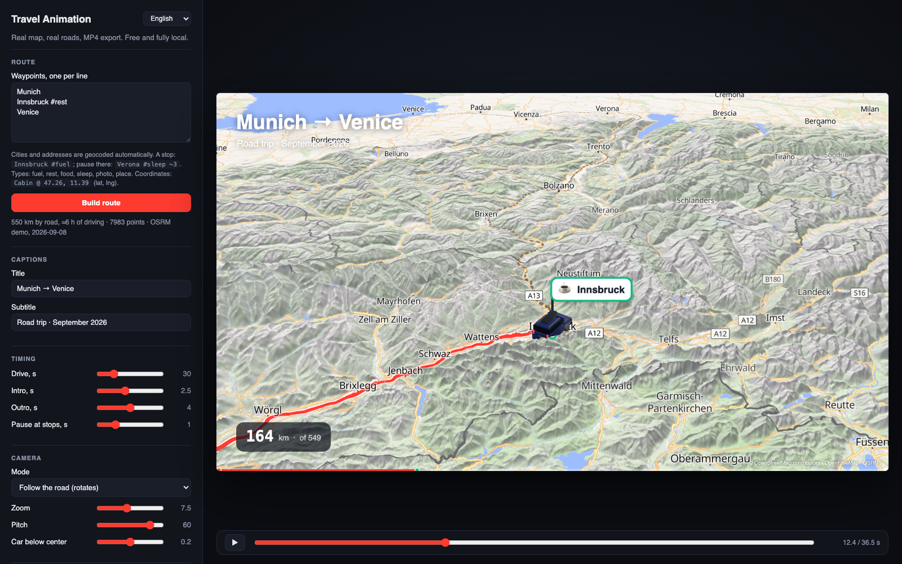

# Travel Animation

[Русская версия](README.ru.md) · **Live demo: https://topmonroe9.github.io/travel-animation/**

Animate a road trip on a **real map** along a **real road route** and export it to MP4.
A free, self-hosted alternative to travelboast / mult.dev: no API keys, no subscriptions, no backend.
One static page that runs in Chrome.



## Run locally

```bash
git clone https://github.com/topmonroe9/travel-animation.git
cd travel-animation
npm start            # python3 serve.py 8765 — static files with caching disabled
open http://127.0.0.1:8765
```

Use `127.0.0.1` rather than `localhost` (Chrome tries IPv6 first, the dev server listens on IPv4).
Chrome / Edge / Arc are required: export relies on WebCodecs. Internet access is needed for map tiles,
geocoding and routing; libraries are loaded from CDNs and cached by the browser.

The interface follows the browser language (Russian or English) and can be switched in the top-left corner.

## Usage

The panel has four tabs: **Route**, **Video story**, **Map** and **Export**. The export button and the
video length stay at the bottom.

1. **Stops** are a route diagram: each stop is its own row, with road distances between them. Type a city
   or an address and press Enter: Nominatim finds it and OSRM rebuilds the road route (results are cached
   in localStorage). Drag a row by its handle to reorder. The first stop is the start and the last one is
   the finish, unless you pick another type.
2. **Stop menu** (the chevron or the round icon):
   - type: start, finish, fuel, rest, food, overnight, photo, sight, nature, sea, home, place;
   - how it looks on the map: a flag with a label, a round badge on a stem, or hidden (the point only
     shapes the route); a custom label, emoji and color;
   - photos: drop files onto the stop or press “Add”, drag thumbnails to reorder or move them to another
     stop. HEIC from iPhone is converted in the browser. Photos are downscaled to 2400 px and kept in
     IndexedDB, so they survive a reload. “Whole gallery, s” sets how long the photos of this stop play:
     7 photos in 4 seconds flip by quickly;
   - how long the car waits, and exact coordinates instead of geocoding.
3. **Paste as a list** keeps the old text format for quick input:
   `Innsbruck #fuel`, `Verona #sleep ~3`, `Cabin @ 46.49, 11.33`. Photos and styling of stops with the
   same name are kept.
4. **Odometer**: “Start at” sets the initial reading — for the second part of a trip the counter can run
   from 2,500 instead of zero. “of N km” can be hidden.
5. **Video story**: captions, the gallery style (polaroids dropping into a pile, or slides with a
   crossfade), photo size in the frame, seconds per photo, timing. “Driving” is pure motion time; stops and galleries add to it.
6. **Export MP4**: pick 16:9, 9:16 (Reels, Shorts, TikTok) or 1:1 and the quality. Rendering is frame by
   frame inside this tab; keep it visible, because browsers stop rendering background tabs.

Space or a click on the frame plays the preview. Stop markers on the scrubber jump to the stop, and a
stop menu has a “Play” button that plays the approach and the gallery.

In the frame: title and subtitle, a running kilometre counter (from any starting value), a progress bar
with stop ticks, a dashed line for the road ahead, the travelled path with a glow, stop flags or badges
that pop up next to the car as it arrives, a photo gallery at a stop (the car slows down, the photos fly
out of the flag, flip and fly back, then the car drives on), the car itself as a flat
top-down SVG icon, a low-poly 3D model rendered with three.js (hatchback with roof rails and a roof box)
or your own PNG, hillshade and 3D terrain with adjustable exaggeration, and a sky at the horizon when
the camera is pitched.

## Architecture

```
Stops (list) ──────▶ Nominatim (geocoding) ──▶ OSRM demo (road route, GeoJSON)
                                                        │
                                                        ▼
                                  Polyline: cumulative km, point/bearing at d, slice 0…d
                                                        │
 Timeline t ──▶ intro → drive (segments between stops, braking + holds / galleries) → outro
                                                        │
                                                        ▼
                     Camera: centre shifted ahead, zoom, smoothed bearing, pitch
                                                        │
                                                        ▼
        MapLibre GL ── OpenFreeMap (vector tiles, localized labels) + AWS Terrain (DEM)
        layers: hillshade / terrain / sky · route ahead · travelled (glow+casing+line)
               · stop flags · car (SVG symbol | three.js custom layer)
                                                        │
                     HUD (canvas 2D): captions, km, progress, photo gallery, attribution
                                                        │
   export: for t in frames → jumpTo/setData → wait for idle → composite(map+hud) → VideoFrame
           → VideoEncoder (H.264, WebCodecs) → mp4-muxer → Blob → download .mp4
```

The key principle is **determinism**: the whole frame state is a function of time `t`. Preview and export
call the same `render(t)`, so the video matches what you see on screen, and tiles and glyphs are always
loaded because the exporter waits for the map's `idle` event before grabbing a frame.

| Module | Responsibility |
| --- | --- |
| `src/geo.js` | haversine, bearing, destination, Mercator, `Polyline` with binary search by distance, camera bearing smoothing |
| `src/route.js` | stop types, text list parser, Nominatim, OSRM, cache, stop positions along the route |
| `src/timeline.js` | phases, segments between stops with acceleration and braking, holds, camera for a given state |
| `src/points-ui.js` | stop editor: route diagram, stop menu, dragging stops and photos |
| `src/photos.js` | photo import (downscaling, HEIC via heic2any), IndexedDB storage |
| `src/gallery.js` | the gallery at a stop: polaroids and slides |
| `src/scene.js` | MapLibre: style, label language, terrain, route/stop/car layers, waiting for `idle` |
| `src/car3d.js` | three.js custom layer; the hatchback is built from extruded side profiles (`buildCar`), roof box and rails included |
| `src/hud.js` | 2D canvas overlay |
| `src/exporter.js` | WebCodecs + mp4-muxer |
| `src/i18n.js` | Russian / English dictionaries and DOM translation |
| `src/app.js` | UI, state, preview loop, export |

## Why this stack

| Option | Verdict |
| --- | --- |
| **MapLibre + WebCodecs in the browser** (chosen) | zero dependencies and servers, deterministic frame-by-frame rendering, hardware H.264 |
| Puppeteer + ffmpeg | more robust for 4K and very long clips, but needs a Node script and headless Chrome. The page is ready for it: `window.__app.setTime(t)` plus `scene.idle()` produce a frame, screenshot it into `ffmpeg -f image2pipe` |
| MediaRecorder / screen capture | real time, drops frames, depends on machine speed |
| Remotion | React video framework, nice but an extra layer and a company licence |
| Python (cartopy / folium + matplotlib) | static tiles, no smooth camera or terrain |
| Mapbox GL | prettier sky and terrain, but tokens and billing; MapLibre is the free fork |

## Free services and their limits

- **OpenFreeMap** — OpenStreetMap vector tiles, no key, styles liberty / bright / positron / fiord / dark.
- **OSRM demo** (`router.project-osrm.org`) — road routing without a key but without guarantees.
  If it goes down, self-host in ~20 minutes with a Geofabrik extract of your region:
  ```bash
  wget https://download.geofabrik.de/europe/austria-latest.osm.pbf
  docker run -t -v $PWD:/data ghcr.io/project-osrm/osrm-backend osrm-extract -p /opt/car.lua /data/austria-latest.osm.pbf
  docker run -t -v $PWD:/data ghcr.io/project-osrm/osrm-backend osrm-partition /data/austria-latest.osrm
  docker run -t -v $PWD:/data ghcr.io/project-osrm/osrm-backend osrm-customize /data/austria-latest.osrm
  docker run -t -i -p 5000:5000 -v $PWD:/data ghcr.io/project-osrm/osrm-backend osrm-routed --algorithm mld /data/austria-latest.osrm
  ```
  then point the `OSRM` constant in `src/route.js` at `http://127.0.0.1:5000/route/v1/driving/`.
- **Nominatim** — geocoding, at most 1 request per second; responses are cached in localStorage.
- **AWS Terrain Tiles** (Mapzen terrarium) — open elevation data for hillshade and 3D terrain.
- **Google Fonts** (Inter, JetBrains Mono, Caveat for polaroid captions) — falls back to system fonts offline.
- **heic2any** (jsDelivr) — loaded only when a HEIC photo cannot be decoded by the browser.
- Map data © OpenStreetMap contributors (ODbL): the attribution is drawn into the frame, keep it.

## Export performance

Every frame waits for all tiles to load, so speed depends on network and GPU. On a laptop with a GPU a
1080p frame takes 50–150 ms; a 36-second clip at 30 fps takes 2–4 minutes. 4K at 60 fps is proportionally
slower and deserves a 40–60 Mbit/s bitrate. The file is assembled in memory: export very long 4K clips in parts.

## Ideas

- Multi-day trips with dates, phone videos in the gallery.
- Manual camera keyframes (linger on a mountain pass).
- Flight / train segments drawn as arcs instead of roads.
- Load a glTF car with `GLTFLoader` instead of the procedural one (replace `buildCar` in `src/car3d.js`).
- Puppeteer renderer for 4K.

## License

MIT. Map data © OpenStreetMap contributors, ODbL.
