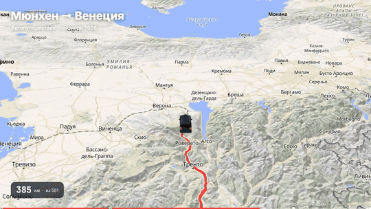
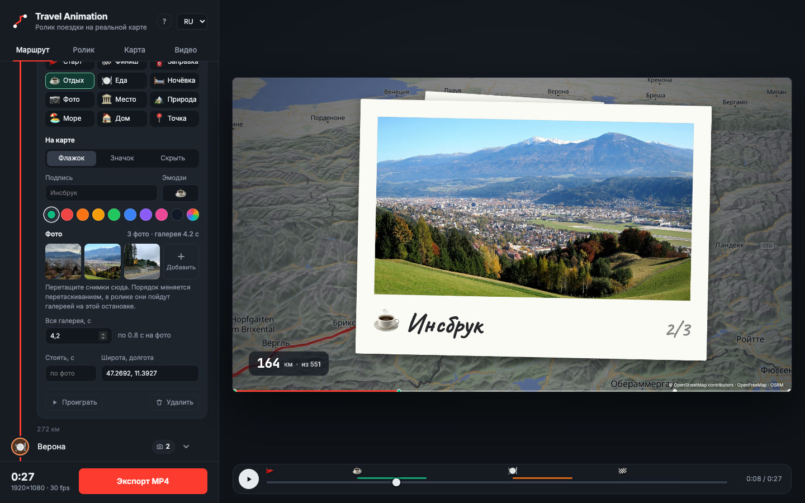

# Travel Animation — анимация маршрута путешествия на карте

[English](README.md)

**Ролик вашей поездки на анимированной карте: машинка едет по настоящим дорогам, на остановках
показываются ваши фото, а на выходе — MP4 для Reels, TikTok или YouTube. Бесплатно, прямо в браузере,
без регистрации и водяных знаков.**

### 👉 [Открыть Travel Animation](https://topmonroe9.github.io/travel-animation/) · [Пошаговая инструкция](https://topmonroe9.github.io/travel-animation/guide/ru/)



Ничего устанавливать и регистрироваться не нужно, аккаунт GitHub тоже не нужен: откройте ссылку выше
в Chrome, Edge или Arc на компьютере.

## Как сделать ролик

1. **Добавьте точки.** Впишите город или адрес и нажмите Enter. Маршрут построится по дорогам, между
   точками появятся километры. Порядок меняется перетаскиванием. Весь список сразу можно вставить кнопкой
   «Вставить списком».
2. **Оформите остановки и добавьте фото.** Нажмите на значок точки: выберите тип (заправка, отдых, еда,
   ночёвка, место, природа, море…), вид на карте (флажок, значок или без маркера), подпись, эмодзи и цвет.
   Перетащите фото прямо на точку, снимки с iPhone тоже подходят. «Вся галерея, с» задаёт, сколько идут
   фото этой точки.
3. **Настройте ролик.** На вкладке «Ролик» — титры, вид галереи (полароиды или слайды), размер фото,
   секунды на фото и тайминг. На вкладке «Маршрут» можно начать счётчик километров не с нуля, а, например,
   с 2 500 — для второй части поездки.
4. **Сохраните MP4.** На вкладке «Видео» выберите формат 16:9 (YouTube), 9:16 (Reels, Shorts, TikTok)
   или 1:1 и качество до 4K. Нажмите «Экспорт MP4» и не сворачивайте вкладку, пока идёт сборка.



## Что будет в ролике

- маршрут по настоящим дорогам: пройденный путь светится, впереди пунктир;
- объёмная машинка (или ваша картинка), камера поворачивает вместе с дорогой;
- рельеф с объёмными горами и тенями;
- флажки и значки остановок с эмодзи;
- галереи фото на остановках: машина тормозит, снимки вылетают из флажка, листаются и улетают обратно;
- заголовок, подзаголовок, бегущий счётчик километров и полоса прогресса с метками остановок.

## Частые вопросы

**Это бесплатно?** Да, полностью: без подписки, водяных знаков и регистрации. Код открыт (MIT).

**Куда уходят мои фото?** Никуда. Они обрабатываются и хранятся в браузере на вашем компьютере.
В интернет уходят только названия точек (чтобы найти их на карте) и координаты (чтобы построить маршрут).

**Какой браузер нужен?** Chrome, Edge или Arc на компьютере. На телефоне экспорт не проверялся.

**Сколько длится экспорт?** Зависит от длины ролика, качества и интернета: 30 секунд в 1080p обычно
собираются за несколько минут.

**Это аналог TravelBoast, Mult.dev или Travel Animator?** Делает такой же тип видео — анимированный маршрут
на карте — бесплатно, до 4K и без водяных знаков.

Подробная инструкция с картинками: https://topmonroe9.github.io/travel-animation/guide/ru/

---

# Для разработчиков

## Запуск локально

```bash
git clone https://github.com/topmonroe9/travel-animation.git
cd travel-animation
npm start            # python3 serve.py 8765 — статика без кеширования
open http://127.0.0.1:8765
```

Открывать именно `127.0.0.1`, а не `localhost` (Chrome сначала пробует IPv6, а сервер слушает IPv4).
Сборки нет: это статические файлы, библиотеки подключены с CDN. Любой пуш в `main` публикуется на
GitHub Pages. Интерфейс подстраивается под язык браузера (русский или английский).

Подробности интерфейса: точки хранятся в localStorage, фото — в IndexedDB (уменьшенные до 2400 px,
HEIC через heic2any), текстовый формат «Вставить списком» — `Инсбрук #заправка`, `Верона #ночёвка ~3`,
`Дача @ 46.49, 11.33`. «Езда» в тайминге — чистое время движения, остановки и галереи добавляются к нему.
Для поисковиков и нейросетей есть `guide/` (RU/EN), `llms.txt`, `sitemap.xml` и JSON-LD на страницах.

## Архитектура

```
Точки (список) ─▶ Nominatim (геокодинг) ──▶ OSRM demo (маршрут по дорогам, GeoJSON)
                                                     │
                                                     ▼
                                    Polyline: километраж, точка/курс по d, срез 0…d
                                                     │
 Таймлайн t ──▶ интро → езда (участки между остановками, торможение + паузы и галереи) → финал
                                                     │
                                                     ▼
                                Камера: центр со сдвигом вперёд, зум, курс (сглаженный), наклон
                                                     │
                                                     ▼
        MapLibre GL ── OpenFreeMap (векторные тайлы, подписи на языке интерфейса) + AWS Terrain (DEM)
        слои: hillshade / terrain / небо · маршрут-вперёд · пройдено (glow+casing+line)
              · флажки остановок · машина (symbol SVG | three.js custom layer)
                                                     │
                          HUD (canvas 2D): титры, км, прогресс, галерея фото, атрибуция
                                                     │
   экспорт: for t in кадры → jumpTo/setData → ждём idle → composite(map+hud) → VideoFrame
            → VideoEncoder (H.264, WebCodecs) → mp4-muxer → Blob → скачивание .mp4
```

Ключевой принцип — **детерминированность**: всё состояние кадра вычисляется как функция времени `t`.
Превью и экспорт вызывают один и тот же `render(t)`, поэтому видео совпадает с тем, что видно на экране,
а тайлы и глифы успевают загрузиться, потому что экспортёр ждёт событие `idle` карты перед захватом кадра.

| Модуль | За что отвечает |
| --- | --- |
| `src/geo.js` | гаверсинус, азимут, точка по азимуту, Mercator, `Polyline` с бинарным поиском по километражу, сглаживание курса камеры |
| `src/route.js` | типы точек, парсер текстового списка, Nominatim, OSRM, кеш, километраж точек на маршруте |
| `src/timeline.js` | фазы, участки между остановками с разгоном и торможением, паузы, камера для состояния |
| `src/points-ui.js` | редактор точек: схема маршрута, меню точки, перетаскивание точек и фото |
| `src/photos.js` | импорт фото (уменьшение, HEIC через heic2any), хранение в IndexedDB |
| `src/gallery.js` | галерея на остановке: полароиды и слайды |
| `src/scene.js` | MapLibre: стиль, язык подписей, рельеф, слои маршрута/остановок/машины, ожидание `idle` |
| `src/car3d.js` | custom-слой three.js; модель хэтчбека собирается из выдавленных боковых профилей (`buildCar`), там же автобокс и рейлинги |
| `src/hud.js` | оверлей на 2D-канвасе |
| `src/exporter.js` | WebCodecs + mp4-muxer |
| `src/i18n.js` | словари RU / EN и перевод DOM |
| `src/app.js` | UI, состояние, цикл превью, экспорт |

## Почему именно так

| Вариант | Вердикт |
| --- | --- |
| **MapLibre + WebCodecs в браузере** (выбран) | ноль зависимостей и серверов, детерминированный покадровый рендер, H.264 аппаратно |
| Puppeteer + ffmpeg | надёжнее для 4K и очень длинных роликов, но нужен Node-скрипт и headless Chrome. Страница уже готова к этому: `window.__app.setTime(t)` и `scene.idle()` дают кадр, остаётся скриншотить в `ffmpeg -f image2pipe` |
| MediaRecorder / захват экрана | реальное время, теряет кадры, зависит от мощности машины |
| Remotion | React-фреймворк для видео, красиво, но лишний слой и лицензия для компаний |
| Python (cartopy / folium + matplotlib) | статичные тайлы, нет плавной камеры и рельефа |
| Mapbox GL | красивее небо и рельеф, но токен и биллинг; MapLibre — его свободный форк |

## Бесплатные сервисы и их ограничения

- **OpenFreeMap** — векторные тайлы OpenStreetMap, без ключа, стили liberty / bright / positron / fiord / dark.
- **OSRM demo** (`router.project-osrm.org`) — маршрутизация по дорогам без ключа, но без гарантий.
  Если ляжет, можно поднять свой за 20 минут на выгрузке Geofabrik нужного региона:
  ```bash
  wget https://download.geofabrik.de/europe/austria-latest.osm.pbf
  docker run -t -v $PWD:/data ghcr.io/project-osrm/osrm-backend osrm-extract -p /opt/car.lua /data/austria-latest.osm.pbf
  docker run -t -v $PWD:/data ghcr.io/project-osrm/osrm-backend osrm-partition /data/austria-latest.osrm
  docker run -t -v $PWD:/data ghcr.io/project-osrm/osrm-backend osrm-customize /data/austria-latest.osrm
  docker run -t -i -p 5000:5000 -v $PWD:/data ghcr.io/project-osrm/osrm-backend osrm-routed --algorithm mld /data/austria-latest.osrm
  ```
  и поменять константу `OSRM` в `src/route.js` на `http://127.0.0.1:5000/route/v1/driving/`.
- **Nominatim** — геокодинг, не чаще 1 запроса в секунду; ответы кешируются в localStorage.
- **AWS Terrain Tiles** (Mapzen terrarium) — открытые данные высот для теней и 3D-рельефа.
- **Google Fonts** (Inter, JetBrains Mono, Caveat для подписей на полароидах) — без сети подставится системный шрифт.
- **heic2any** (jsDelivr) — грузится, только если браузер сам не открыл HEIC-фото.
- Данные карты © OpenStreetMap contributors (ODbL): атрибуция уже нарисована в кадре, не убирать.

## Производительность экспорта

Каждый кадр ждёт полной загрузки тайлов, поэтому скорость зависит от сети и GPU. На ноутбуке с GPU
1080p-кадр занимает 50–150 мс; 36-секундный ролик при 30 fps — 2–4 минуты. 4K при 60 fps — соответственно
дольше, битрейт стоит поднять до 40–60 Мбит/с. Файл собирается в памяти: очень длинные 4K-ролики
имеет смысл экспортировать частями.

## Идеи на потом

- Несколько дней с датами, видео с телефона в галерее.
- Ключевые кадры камеры вручную (задержать вид на перевале).
- Сегменты самолётом/поездом с дугой вместо дороги.
- Загрузка glTF-модели машины через `GLTFLoader` вместо процедурной (в `src/car3d.js` заменить `buildCar`).
- Puppeteer-рендер для 4K.

## Лицензия

MIT. Данные карты © OpenStreetMap contributors, ODbL.

Фото в примерах (`docs/`) — Wikimedia Commons, лицензия CC0:
[Innsbruck panorama west](https://commons.wikimedia.org/wiki/File:Innsbruck_panorama_west.JPG),
[Panorama Innsbruck Hungerburg 2023 (2)](https://commons.wikimedia.org/wiki/File:Panorama_Innsbruck_Hungerburg_2023_(2).jpg),
[Road in Alps, Bayern](https://commons.wikimedia.org/wiki/File:Road_in_Alps,_Bayern,_Germany_01.jpg),
[Verona cityscape sunny](https://commons.wikimedia.org/wiki/File:Verona_cityscape_sunny.jpg),
[A view of Verona from Castel San Pietro](https://commons.wikimedia.org/wiki/File:A_view_of_Verona_from_Castel_San_Pietro.jpg),
[The Grand Canal, Venice 2016](https://commons.wikimedia.org/wiki/File:The_Grand_Canal,_Venice_2016.jpg),
[Venice Canal 20170512](https://commons.wikimedia.org/wiki/File:Venice_Canal_20170512.jpg).
